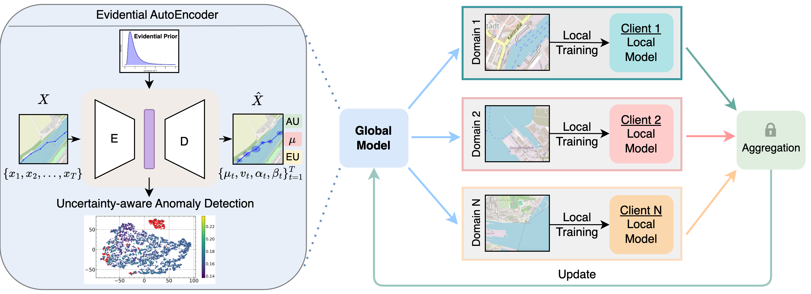
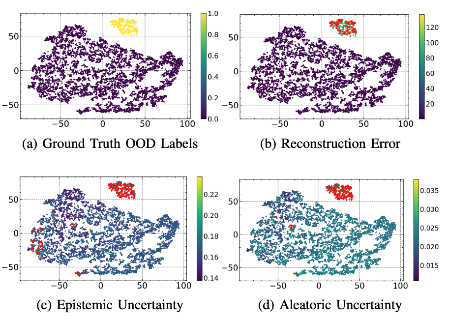

# Towards Cognitive Situational Awareness in Maritime Traffic Using Federated Evidential Learning

## Introduction
This repository contains the official implementation of the paper *"Towards Cognitive Situational Awareness in Maritime Traffic Using Federated Evidential Learning"*, submitted for the [CogSIMA 2025](https://edas.info/web/cogsima2025/submissions.html) conference.

We present the **F**ederated **E**vidential Learning for **A**nomaly Detection of **S**hip **T**rajectories (**FEAST**) framework, which integrates Federated Learning and Evidential Learning to provide a privacy-preserving, collaborative, and uncertainty-aware approach to anomaly detection in maritime traffic.

This research has been funded by the German Federal Ministry for Digital and Transport within the project ``CAPTN Förde Areal II - Praxisnahe Erforschung der (teil)autonomen, emissionsfreien Schifffahrt im digitalen Testfeld'' (45DTWV08D).

## Requirements
To install all the requirements, one needs to first install:

+ conda
+ poetry
+ flower

A detailed list of the required libraries can be found in:

+ poetry.toml

The proper installation must then be done with poetry and conda.

## Data Splitting Strategy
The dataset used for training and evaluation comprises AIS signals collected from the Kiel Fjord region between **March 24, 2022, and June 30, 2023**. It is partitioned into training and validation sets while maintaining a representative distribution of ship trajectories across different **seasons**. As the dataset is the property of the [CAPTN](https://captn.sh/foerde-areal/) research project and subject to data privacy restrictions, it is not publicly available. Interested users should contact the authors for further inquiries.

### Federated Data Partitioning

The dataset is divided among multiple clients using three partitioning strategies:

- **IID Partitioning:** The dataset is split randomly among clients, ensuring that each client receives a statistically similar subset.
- **Natural ID Partitioning:** Data is grouped based on a specific identifier (e.g., ship ID, trajectory ID) to maintain the natural distribution of trajectories.
- **Dirichlet Partitioning:** Data is distributed using a Dirichlet distribution to simulate **non-IID scenarios**, where clients have varying proportions of data.

### Preprocessing & Outlier Removal

Before partitioning, the dataset undergoes **cleaning and outlier removal** on key features (`speed_c`, `lon`, `lat`) based on quantile thresholds. After cleaning, the dataset is converted into **sequence-based trajectory samples** with a fixed sequence length (`960` time steps).

### Client-wise Seasonal Data Distribution

Each client receives a unique subset of the dataset with varying distributions of **Spring, Summer, Autumn, and Winter** data. The seasonality of each client's data is shown below:

| Season  | Client 1  | Client 2  | Client 3  | Client 4  |
|---------|----------|----------|----------|----------|
| **Spring** | 0        | 119,208  | 1,952,640 | 1,975,680 |
| **Summer** | 1,920,000 | 195,713  | 0        | 0        |
| **Autumn** | 0        | 1,168,264 | 0        | 0        |
| **Winter** | 0        | 758,415  | 0        | 0        |

This federated data partitioning ensures that clients receive **diverse but realistic** AIS trajectory data while maintaining the **privacy** and **distributed nature** of Federated Learning.

### Latent Representation of FEAST with OOD Analysis

**Figure**: (a) Ground truth OOD labels, where yellow points represent OOD samples and purple points indicate in-distribution data.  
(b) Reconstruction error, with red points exceeding the threshold.  
(c) Epistemic uncertainty, where red points are classified as OOD based on uncertainty thresholds.  
(d) Aleatoric uncertainty, where red points similarly denote OOD samples.

## Authors and acknowledgment
- [Shang Gao](mailto:sgao@informatik.uni-kiel.de) / [sgao@uni-kassel.de](mailto:sgao@uni-kassel.de)  
- [Zhixin Huang](mailto:zhixin.huang@uni-kassel.de)
- [Ghassan al Falouji](mailto:gaf@informatik.uni-kiel.de)    

## License
We use the MIT license, see

+ LICENSE

## Citation
